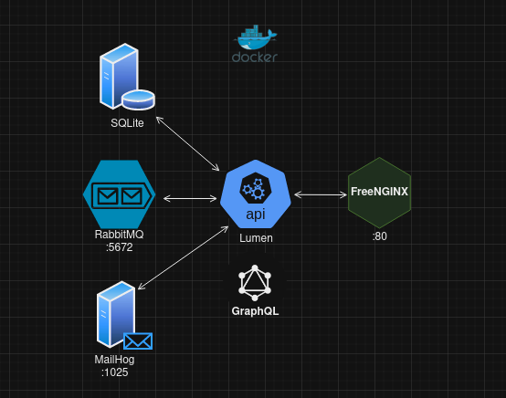

# API Doc



### 
- REST JSON
- GraphQL
- [Queue Messaging (RabbitMQ)](./RabbitMQ.md)
- Mailhog

### Start project
```sh
docker compose up -d --build
cd api
chmod u+x startServices.sh
./startServices.sh
```

## Tests

### Articles GraphQL endpoint
```sh
cd cd modules/article/
vendor/bin/phpunit --filter GetArticlesGraphQlTest
```

### Test Queue Messagin
```sh
cd cd modules/article/
vendor/bin/phpunit --filter GetArticlesTest
cd ../../
php consumer.php
Access Mailhog at http://localhost:8025/
```

## Article Requests
### List Articles
```sh
curl -X GET http://localhost/api/articles
```
### Create Article
```sh
curl -X POST \
  -H "Content-Type: application/json" \
  -d '{"title":"New Article","body":"Lorem ipsum"}' \
  http://localhost/api/articles
```
### GraphQL Endpoint
```sh
curl -X POST \
  -H "Content-Type: application/json" \
  -d '{"query":"{ getArticles { uuid title body } }"}' \
  http://localhost/api/articles/graphql
```
